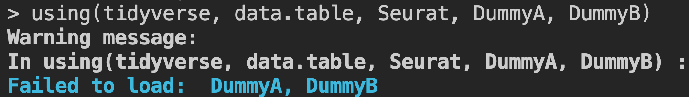

# pak

> Library Packages Without Starting Messages

<!-- badges: start -->
[](https://cran.r-project.org/package=using)
<!-- badges: end -->

 using librarys R packages. It is an alternative to library() and require(). using is fast, safe and convenient.

## Install using from CRAN or github

``` r
install.packages("using")
remotes::install_github("ScienceAdvances/using")
```

## Use using to load packages

``` r
library(using)
# load installed packages
using(tidyverse, data.table, Seurat)
# load installed and uninstalled packages(DummyA,DummyB not exist so we did not install them)
using(tidyverse, data.table, Seurat, DummyA, DummyB)
```
