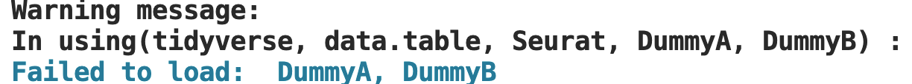

# pak

> Load Multiple Packages Without Starting Messages at Once

<!-- badges: start -->
[](https://cran.r-project.org/package=using)
<!-- badges: end -->

using loads R packages. It is an alternative to `library()` and `require()`. using is fast, safe and convenient.

## Install using from CRAN or github

``` r
install.packages("using")
remotes::install_github("ScienceAdvances/using")
```

## Use using to load packages
load installed packages without starting messages
``` r
library(using)
using(tidyverse, data.table, Seurat)
```
Load installed and uninstalled packages.   
DummyA and DummyB did not exist, so we did not install them.   
When loading packages by `using` , a warning message in cyan color will show as below.
``` r
using(tidyverse, data.table, Seurat, DummyA, DummyB)
```
